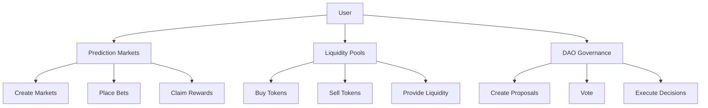
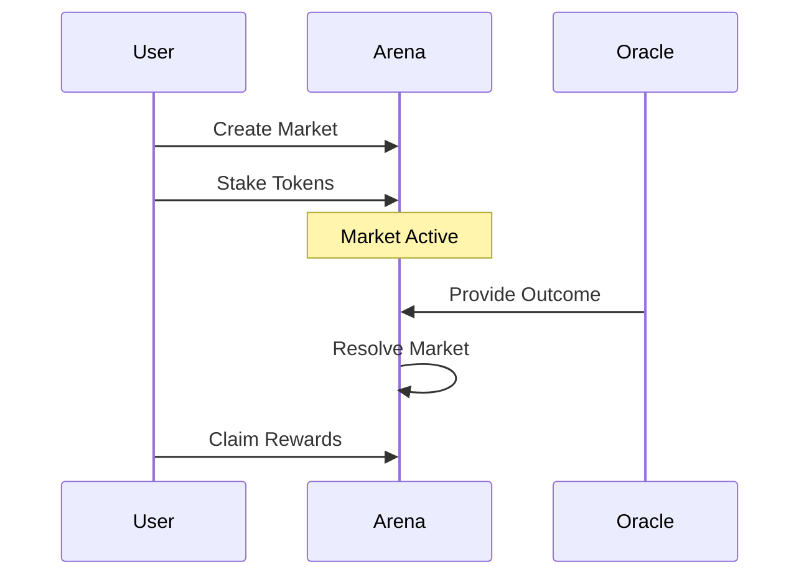
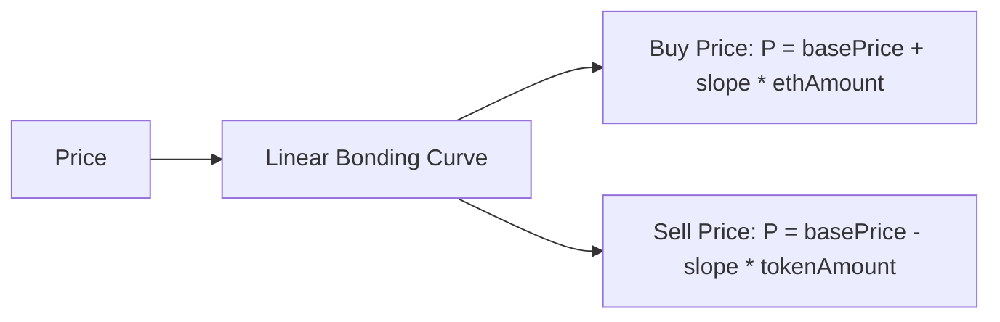
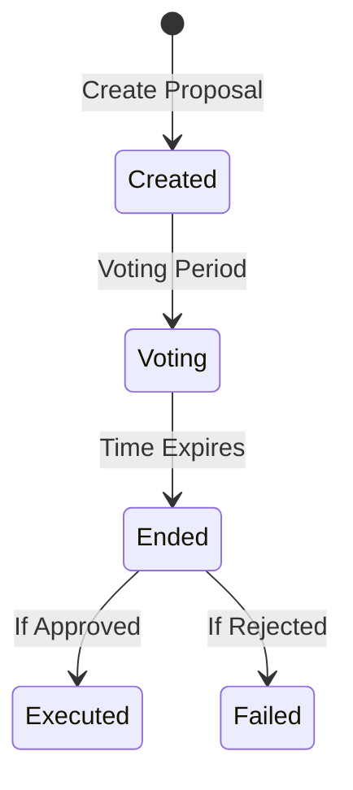
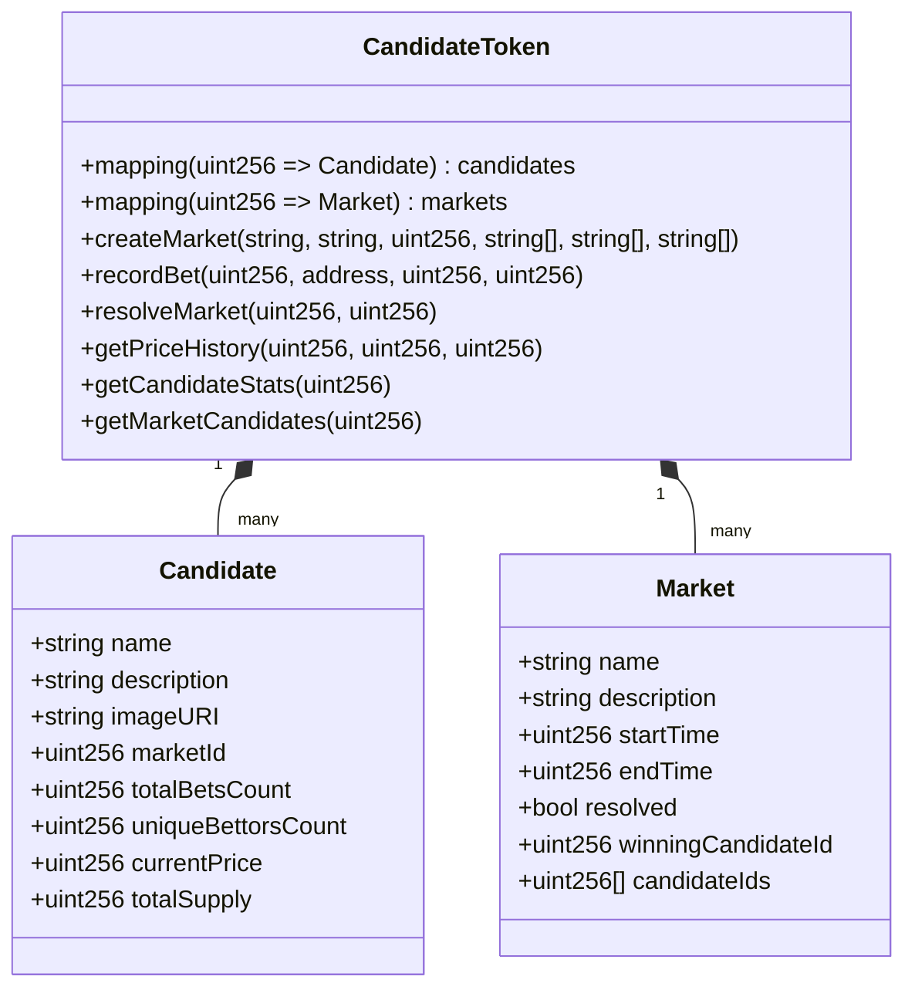
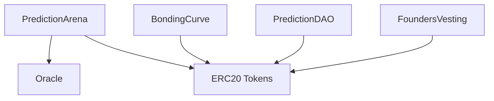

# BonkWars: Decentralized Prediction Markets & Liquidity Pools

## Overview

BonkWars is a comprehensive DeFi platform that combines prediction markets with bonding curve-based liquidity pools. The platform enables users to:

1. Create and participate in prediction markets
2. Trade tokens using an automated market maker with bonding curves
3. Participate in DAO governance



## Core Components

### 1. Prediction Markets (`PredictionArena.sol`)

The prediction market system allows users to:
- Create binary outcome prediction markets (Yes/No)
- Stake tokens on outcomes
- Resolve markets using oracle data
- Claim rewards for winning positions

Key features:
- Fee system for market creation and staking
- Oracle integration for trusted outcome resolution
- Automated reward distribution



### 2. Liquidity Pool (`BondingCurve.sol`)

The liquidity pool implements a linear bonding curve for token pricing:
- Buy price increases linearly with purchase amount
- Sell price decreases linearly with sell amount
- Configurable price bounds and slope

Features:
- Automated price discovery
- Slippage protection
- Minimum purchase amounts
- Pool state management



### 3. Governance (`PredictionDAO.sol`)

The DAO governance system enables:
- Proposal creation
- Token-weighted voting
- Automated execution
- Quorum requirements

Features:
- Configurable voting periods
- Minimum token requirements for proposals
- Safe execution of approved proposals



## Token System

### ERC20 Implementation

The platform uses several token contracts:
1. `EnhancedPredictionMarketToken.sol`: Main governance token
2. `CandidateToken.sol`: Represents individual candidates in prediction markets
3. Market-specific tokens for prediction markets
4. Bonding curve pool tokens

Features:
- Standard ERC20 functionality
- EIP-2612 permit support
- Account freezing capability
- Market-specific functionality

### CandidateToken System

The `CandidateToken` contract uses ERC1155 to efficiently represent multiple candidates in prediction markets:



Features:
- ERC1155 multi-token standard for efficient candidate representation
- Single contract manages multiple prediction markets
- Rich metadata storage (name, description, image) per candidate
- Price and supply history tracking with timestamps
- Comprehensive market and candidate statistics
- Batch operations for market creation and data retrieval
- Gas-efficient token transfers and management

Benefits of ERC1155:
- Reduced gas costs for token transfers
- Batch transfers and approvals
- Single contract for all candidates
- Simplified market management
- Better scalability for multiple markets

### Founders Vesting

The platform includes a vesting system for team tokens:
- Configurable cliff and vesting periods
- Linear vesting schedule
- Emergency controls
- Revocation capability for certain allocations

## Smart Contract Architecture



## Usage

### Prerequisites
- Foundry for development and testing
- Solidity ^0.8.15
- Node.js and npm (optional, for frontend)

### Installation

```bash
# Clone the repository
git clone https://github.com/your-username/bonkwars-remote.git

# Install dependencies
forge install

# Run tests
forge test

# Deploy
forge script script/Deploy.s.sol:Deploy --rpc-url $RPC_URL --private-key $PRIVATE_KEY
```

### Running Tests

The project includes comprehensive tests for all components:

```bash
# Run all tests
forge test

# Run specific test file
forge test --match-path test/PredictionArena.t.sol

# Run with gas reporting
forge test --gas-report
```

### Deployment

1. Configure environment variables:
```bash
cp .env.example .env
# Edit .env with your values
```

2. Deploy contracts:
```bash
forge script script/Deploy.s.sol:Deploy --rpc-url $RPC_URL --private-key $PRIVATE_KEY --broadcast
```

## Security Considerations

1. Price Manipulation Protection
   - Bonding curve price bounds
   - Minimum purchase amounts
   - Slippage protection

2. Access Control
   - Role-based permissions
   - DAO governance for critical parameters
   - Emergency pause functionality

3. Oracle Security
   - Trusted oracle integration
   - Multiple confirmation requirements
   - Timeout mechanisms

## Contributing

1. Fork the repository
2. Create your feature branch
3. Commit your changes
4. Push to the branch
5. Create a new Pull Request

## License

This project is licensed under AGPL-3.0-only.

## Acknowledgments

- OpenZeppelin for security patterns
- Solmate for optimized implementations
- Foundry for development framework 